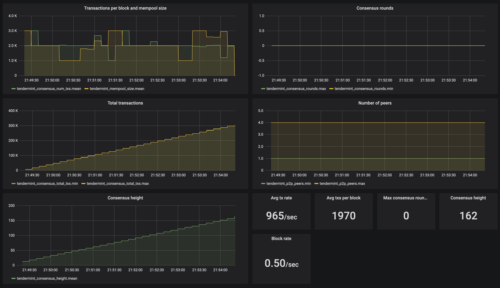
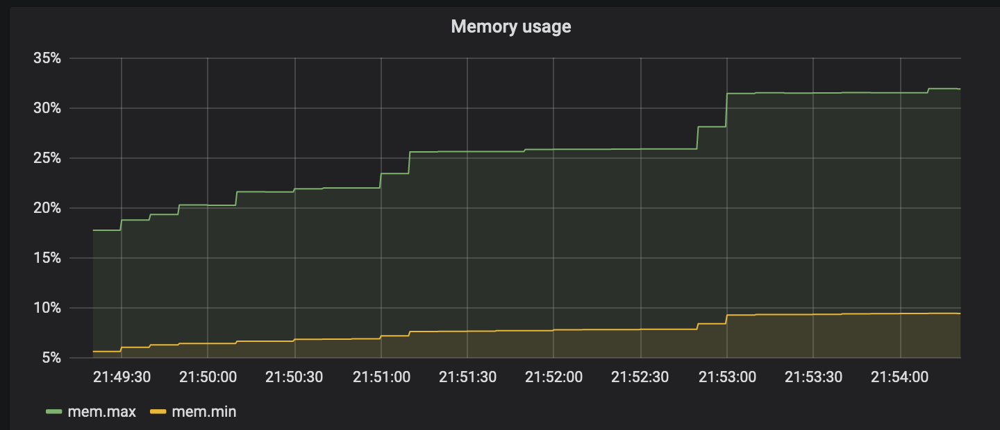
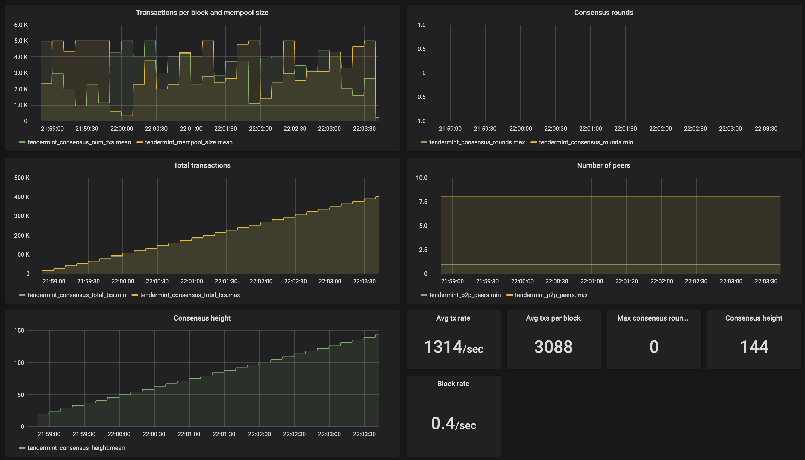
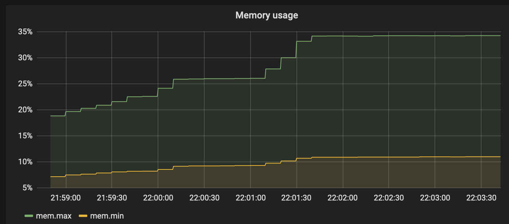
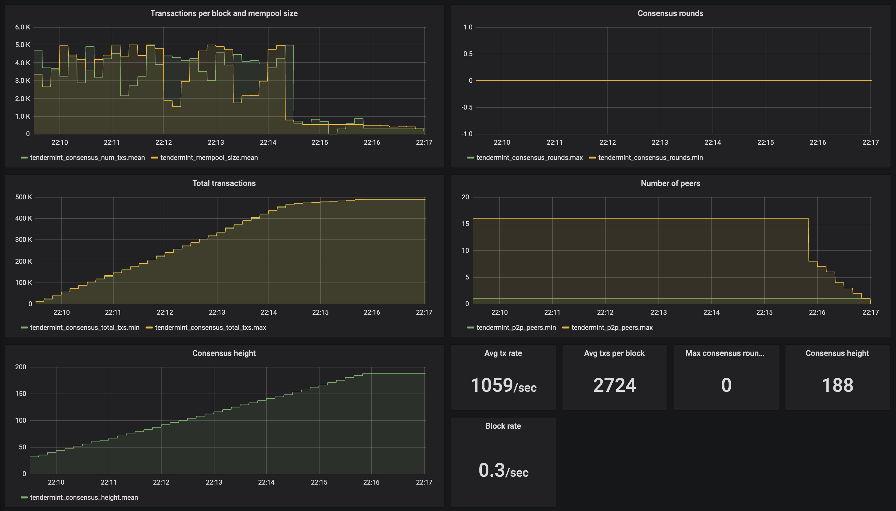
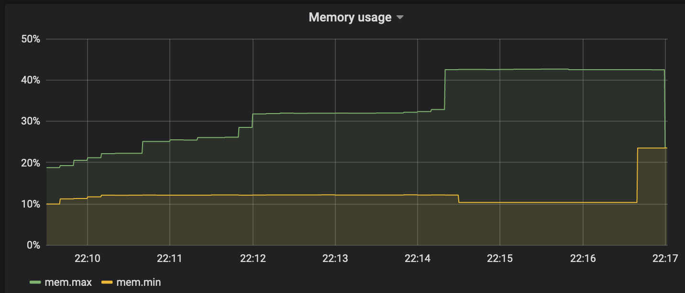
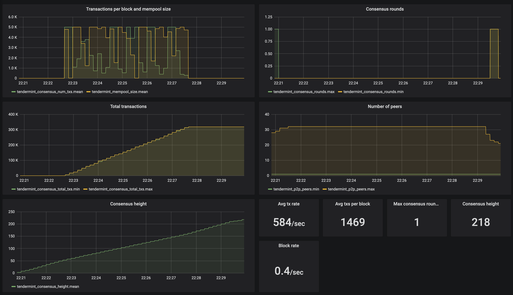
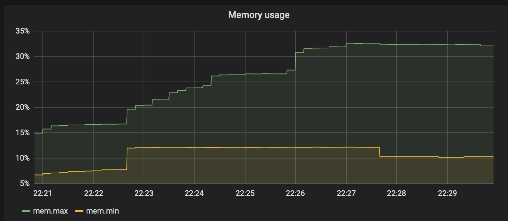

# Game of Tendermint

## Research paper example

### Overview
This is an example execution for the paper
[Tendermint: Byzantine Fault Tolerance in the Age of Blockchains](https://atrium.lib.uoguelph.ca/xmlui/handle/10214/9769)
authored by Ethan Buchman in 2016. The example focuses on the added information and not the formatting.

### Experiments description
- All experiments use `Interchain Nightking image 1571782970` ([AMI IDs](#ami-ids-in-the-different-aws-regions))
- All experiments use `t3.micro` instances (2vCPU, 1GB RAM, 5Gbps burst bandwidth)
- Nightking server is `t3a.medium` (2vCPU, 4GB RAM, 5Gbps burst bandwidth) in us-east-2c availability zone
- mempool is enabled (with a maximum of 5000tx) and mempool recheck is enabled. These were not available in the original paper.

All experiments have similar configuration. N=4,8,16,32 validator nodes dispersed in 16 different AWS regions. The
nodes find each other through Nightking's seed node. Once the network is established,  `tm-load-test` executes
transactions for 5 minutes, up to 1000tx/sec. Meanwhile, Nightking gathers the Tendermint Prometheus metrics into a 
time-series database. At the end of the experiment, Nightking destroys the experiment infrastructure and presents the data
over Grafana web service.

We expect lower throughput because of mempool recheck.

### Results
The InfluxDB portable backup is stored [here](thesis/influxdb-backup). It can be imported into a running InfluxDB to see
the results first-hand.

#### xp004 result
- `N=4` validators.
- 965 tx/sec
- 0.5 block/sec

#### xp008 result
- `N=8` validators.
- 1314 tx/sec
- 0.4 block/sec

#### xp016 result
- `N=16` validators.
- 1059 tx/sec
- 0.3 block/sec

#### xp032 result
- `N=32` validators.
- 584 tx/sec
- 0.4 block/sec

### AMI IDs in the different AWS regions
AMI owner: `400392161012`

AMI description: `Interchain Nightking image 1571782970`

- ap-northeast-1: ami-0cc38a2fef9d449d2
- ap-northeast-2: ami-01119666dbc8c8658
- ap-south-1: ami-0d9b2d1695327c305
- ap-southeast-1: ami-0f2d8ca1fbc48143d
- ap-southeast-2: ami-01dbcabbf4a4ad731
- ca-central-1: ami-0cacb986dc8b98cbd
- eu-central-1: ami-0481aaf62303bf411
- eu-north-1: ami-09b5b40b6bacc0efa
- eu-west-1: ami-0e846329ca597d285
- eu-west-2: ami-04779396e98b3e0dd
- eu-west-3: ami-03cf3ed28e268e566
- sa-east-1: ami-0fcb08fc3b3440d95
- us-east-1: ami-0e9129fb4265e8868
- us-east-2: ami-0e0ab6fdce45b6908
- us-west-1: ami-004e93eface96f3dd
- us-west-2: ami-04facc726f51786f0
